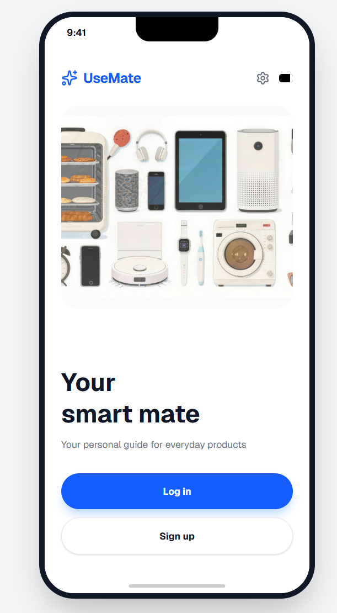
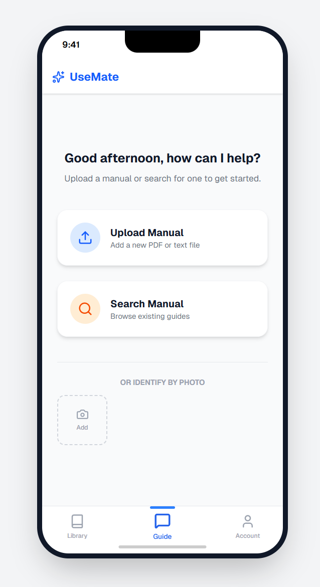
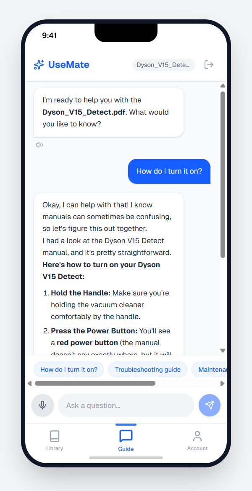

# UseMate AI

UseMate is a smart assistant that transforms product manuals into personal, interactive knowledge.By simply taking photos of manuals, users can build their own digital manual library and ask questions anytime in natural language. UseMate reads the manuals for you and explains them in a friendly, human way.

Instead of struggling with small text and technical terms, especially for elderly users, UseMate turns manuals into conversations and addresses a widespread problem of manual loss, poor readability, and low usability, particularly among elderly and non-technical users.

  
  
  

